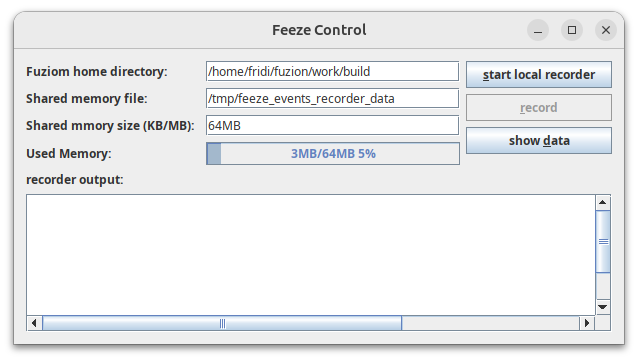
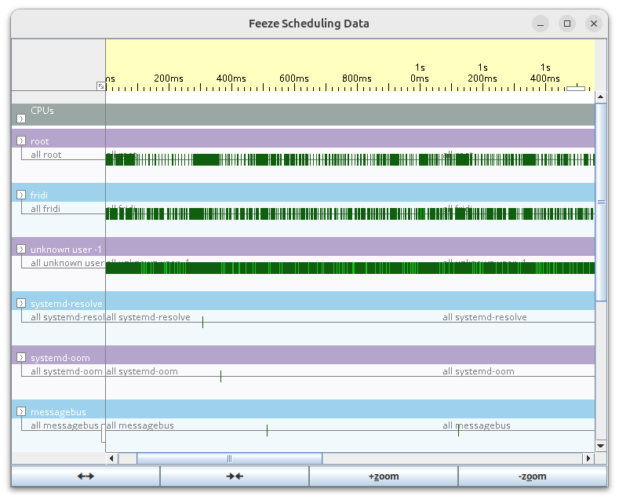
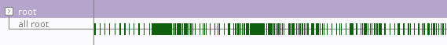
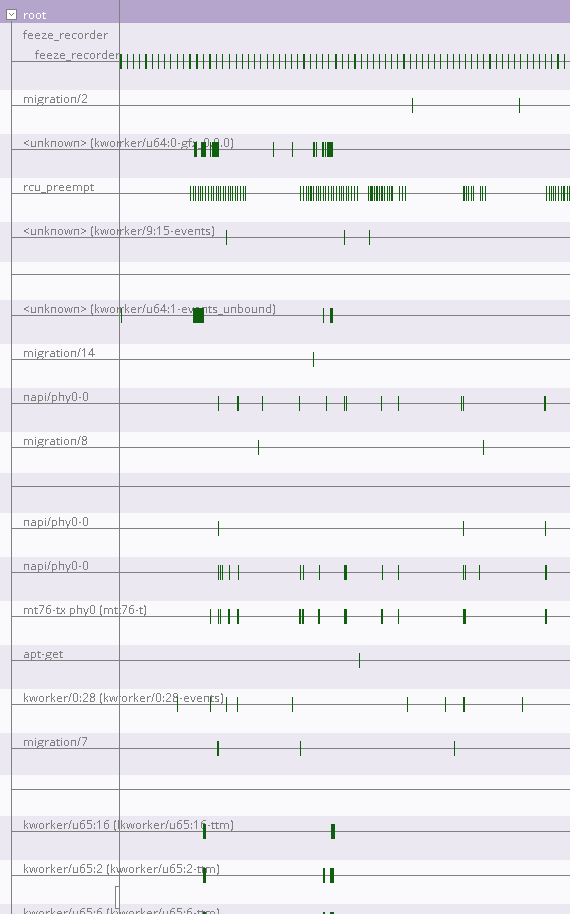
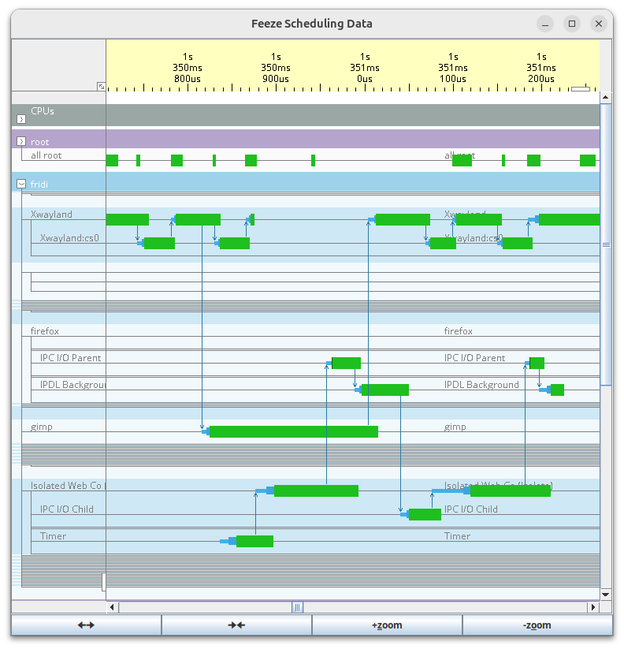
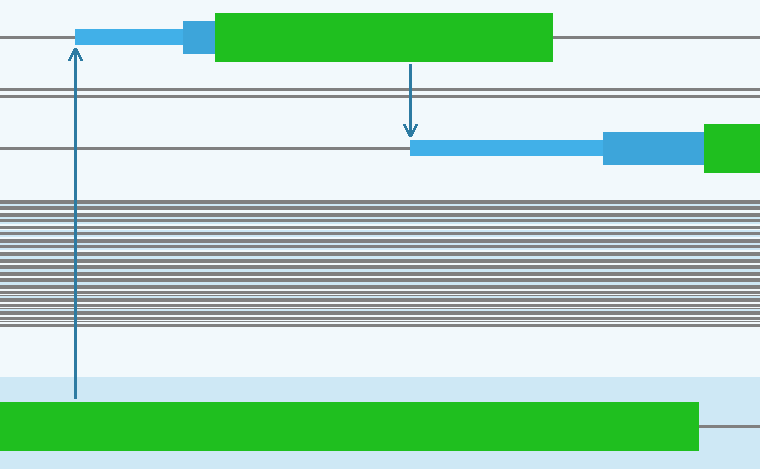
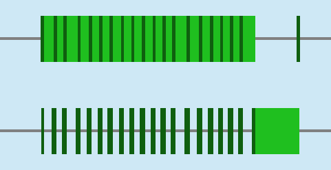

#  feeze User Manual

Feeze is an interactive graphical thread and scheduling analysis tool using eBPF.

## Installation

### From tarball

Installing Feeze from a tarball gives you most control over where feeze will get
installed. You will need to unpack the archive using

    # tar zxf feeze_VERSION_TARGET.tar.gz

where `VERSION` is the feeze version and `TARGET` is the
target Linux version it was built for. For version `0.001dev` build
for `Ubuntu_24`, you will have to use

    # tar zxf feeze_0.001dev_Ubuntu_24.tar.gz

The result will be a directory with a name like `feeze_VERSION_TARGET`, so in
our example of version `0.001dev` build for `Ubuntu_24` the directory name will
be `feeze_0.001dev_Ubuntu_24`.

### Required Dependencies

To run feeze, you will need to install

* OpenJDK version 25 or later

  The Java environment used for the GUI, must not be headless, and

* libgc1.so

  The Boehm-Demers-Weiser's GC that is currently used until by Fuzion until an exact GC is available.

### Running

To start the feeze GUI, run the script `feeze` in the `bin` directory of the installation, e.g., using

    # ./feeze_0.001dev_Ubuntu_24/bin/feeze

## Feeze Control Window

Once started, the feeze control window is opened.

This window provides controls to start the feeze record, to configure the
communication and recording, to start and stop recording and to open a scheduler
data window.

### Starting the feeze recorder

Before you can start recording scheduler events, you will have to start the
`feeze_recorder` with superuser privileges. You can do this using the `start
local recoder` button, a prompt for your password will appear. Note that you
will need the rights to perform `sudo` for this.

NYI: UNDER DEVELOPMENT: Currently, the feeze recorder must run on the same
machine as the feeze GUI. It is planned to permit running the recorder on
another machine and communicate via a network connection.

### Configuring the fuzion installation

For programs written in the Fuzion language, feeze may display trace points that
were added to the Fuzion source code using base module features
`fuzion.runtime.trace(col u8, msg String)` and `fuzion.runtime.trace(msg
String)`. To use these, trace points must be set in the fuzion's runtime
library. For this to work, the path to the Fuzion installation must be given via
the button `Fuzion home directory`.

### Configuring shared memory communication

The feeze recorder communicates with the feeze GUI via shared memory that is
identified by a file name.  This name of this file must be given as `Shared
memory file`. This file may also be used to store scheduling data for later.

Additionally, a maximum size of the shared memory may be given. Trace data may
quickly grow very large, in particular when there are frequent thread
interactions or user trace events.  The `Shared memory size (KB/MB)` field
permits setting the size of this shared memory.  Once a recording has reached
this size, the recording will stop.

Note that overwriting the data in the shared memory file, e.g., by re-starting
the recorder while the date from an earlier trace is being displayed, may result
in currupting the displayed data.

### Recording Scheduling Data

The `record` button or the key combination Alt-R will start recording scheduling
data.  While recording, a blue bar next to `Used Memory:` will display the
amount of shared memory that is used by the recorded data.  This bar will grow
continuously with the recording.  While recording, the `record` button is
changed into a `stop` button. This button or hitting Alt-R again will stop the
current recording.

If not stopped explicitly, the recording will stop automatically once the shared
memory buffer is full.

### Displaying recorded data

Once the scheduling data has been recorded, the data can be displayed using the
`show data` button.  This will result in opening a `Feeze Scheduling Data`
window.  See [Scheduling Data Window](#Scheduling-Data-Window) below for details.

### Control Window Keyboard shortcuts

The following key-combination may be used as shortcuts:

* Alt-S for `start local recorder` button

* Alt-R for `record` button

* Alt-D for `show data` button

## Scheduling Data Window

The scheduling data window looks like this:

### detailed vs. cumulative user / process / thread views

The number of threads recorded can be overwhelmingly large. To reduce the amount
of data displayed, there are cumulative views per user, per process (NYI: UNDER
DEVELOPEMNT) and per thread as follows:

#### cumulative per-user view

Orignally, the scheduling data window it will display cumulative date per
user. In this cumulative view, all processes and threads for one user will be
collapsed into a single line.  E.g., for the root user, the cumulative view may
look like this:

Here, a single horizontal line is labelled `all root` shows the cumulative
activity for user `root`.

To graphically distinguish users easily, the background color alternates between
lilac and blue for different users.

#### cumulative per-process view

NYI: UNDER DEVELOPMENT: It is planned to expand the GUI to show cumulative scheduling data for each process.

To graphically distinguish processes easily, the background color user for processes alternates between
different shades of the underlying user color.

#### per-thread view

Using the small button on the left of a user

you can enable the detailed per-thread view for this user

which shows all the recorded processes of that user and their threads:

Each thread will be shown as one horizontal line.

### Time resolution and thread collapsing

You can expand and compress the time resolution using the left or middle mouse
buttons (see [Mouse Buttons](#Scheduling-Data-Window-Mouse-Buttons)) or by
clicking on the buttons labelled `🠊🠈`/`🠈🠊`.  Holding the left moust button, you
can drag the displayed area.

As you do this, the displayed data will be adjusted dynamically to reduce the
space taken by inactive threads and processes such that more active threads and
processes fit on the visible area:

Here, only processes `Xwaylend`, `firefox`, `gimp`, and `Isolated Web Co
(Isolate)` are shown in detail, while threads of other processes are collapsed
to thin horizontal lines.

### Thread state Display

Thread states are visualized by thickness and color of the horizontal line drawn
for a thread. Here is an enlarged example:

The meaning of the colors in detail is

* very thin horizontal grey line: an inactive thread that is sleeping/blocked.

* thin horizontal light-blue line: `waking` a thread that was woken up from
  being sleeping/blocked, but not yet added to a CPU's ready queue

* horizontal blue bar: `wakesup` a thread that is ready to run waiting in a
  CPU's ready queue.

* thick horizotal green bar: `running` a thread that is running a a CPU.

Thread state changes performed that are caused by different threads are shown
using blue arrows from the thread performing the state change to the affected
thread.

If thread state changes occur too frequently to be displayed at the current time
resolutions, this dark green areas are drawn to illustrate that you need to
expand the time resolution here:

Note that blue arrows showing the thread causing a state change will not be
shown in this case.

### Scheduling Data Window Mouse Buttons

#### time scale:

Expanding the time scale helps gettign a more detailed view of what is
happening, while compressing gives an overview over longer periods.

* left button click/hold: expand time scale one step / repeatedly

* middle button click/hold: compress time scale one step / repeatedly

#### zoom

Zoom help to increase or shrink the size of the overall diplayed graph. This
helps to get the best compromise between readability and amount of data
displayed on the screen.  Note that zooming in our out does not change the
detail of information that is shown, it only changes the size of the graphical
elements.

* shift + left button click/hold: zoom in one step / repeatedly

* shift + middle button click/hold: zoom out one step / repeatedly

#### dragging

Dragging the displayed data area allows moving along the time axis
(horizontally) and the user/processes/threads axis (vertically):

* left button hold and move to drag the displayed area

### Scheduling Data Window Keyboard shortcuts

The following key-combination may be used as shortcuts:

* Alt-X expand time one step

* Alt-C compress time one step

* Alt-Z zoom in one step

* Alt-O zoom out one step

* Ctrl-W close window

* ctrl-Q quite feeze GUI

* Alt-D for `show data` button
